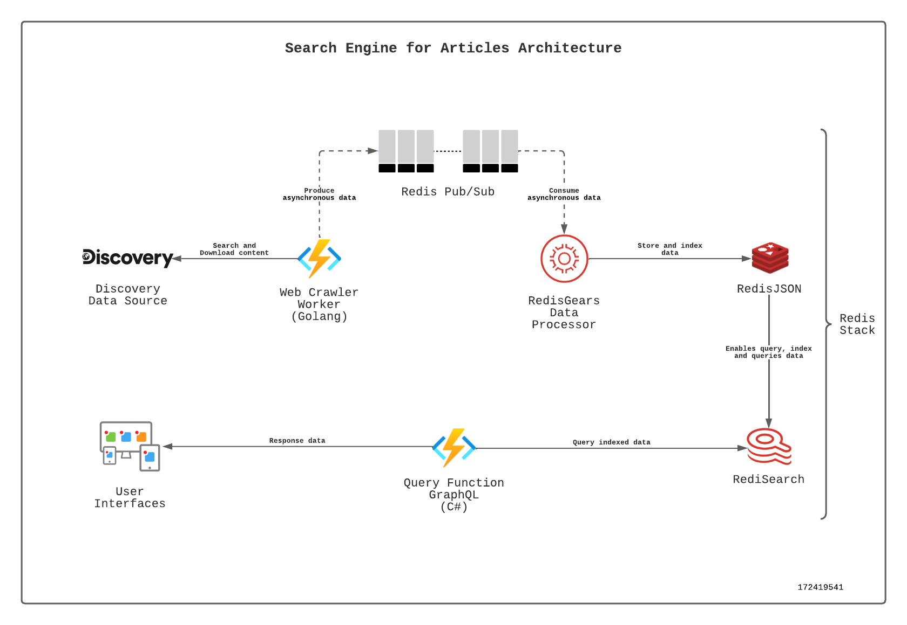
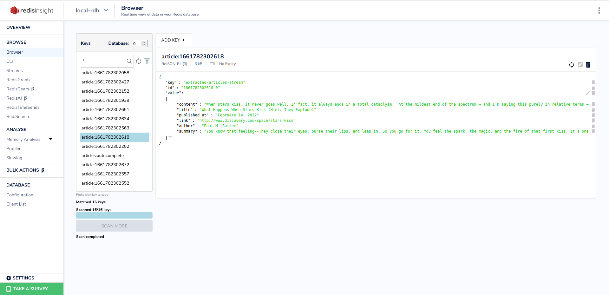
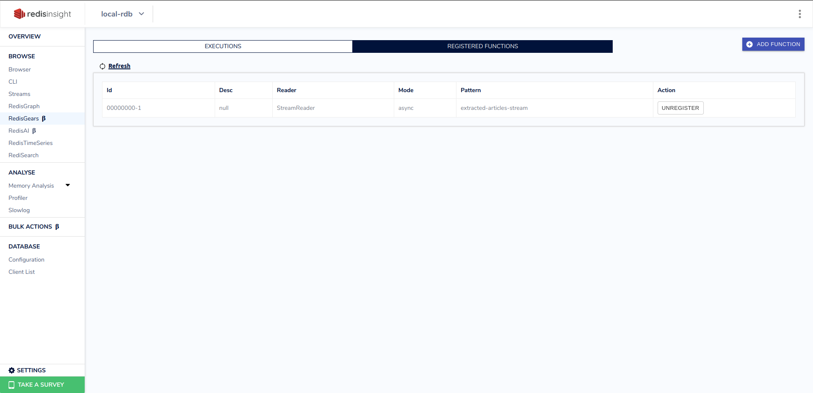
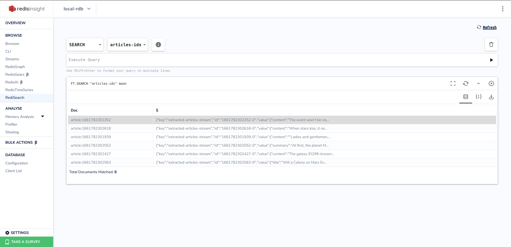
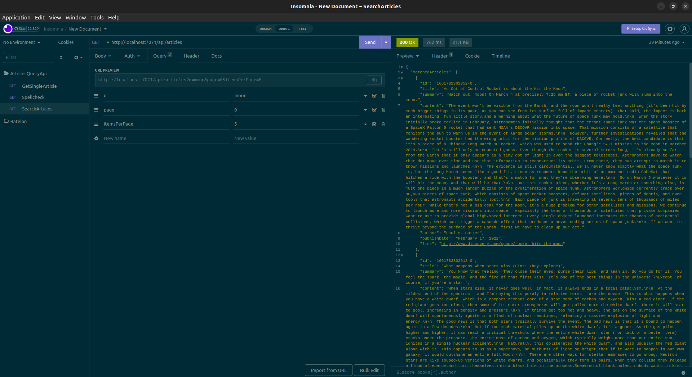

# Articles Discovery Engine

Search engine system for articles using the redis technology stack. A tool that extracts articles and streams this information to the redis cluster, where processing is done with Redis Gears to add the data as JSON documents in RedisJson and indexes it to enable search with RediSearch.

## Architecture Diagram

[](./docs/arch.png)

## Features demo

- Demo Web Application:
[]() 

- RedisJSON Data:
[]()

- RedisGears Function Registered:
[]()

- RediSearch search indexed documents:
[]()

- Backend Query API:
[]()

## How it works

### How the data is stored:

Refer to [this example](https://github.com/redis-developer/basic-analytics-dashboard-redis-bitmaps-nodejs#how-the-data-is-stored) for a more detailed example of what you need for this section.

### How the data is accessed:

Refer to [this example](https://github.com/redis-developer/basic-analytics-dashboard-redis-bitmaps-nodejs#how-the-data-is-accessed) for a more detailed example of what you need for this section.

## How to run it locally?

### Prerequisites

- Go - v1.18.4
- Dotnet - v6.0.108
- Docker - v20.10.14 (optional)

### Local installation

Go to `/deploy/docker` folder (`cd ./deploy/docker`) and then:

```
# run docker compose or install redis manually
docker-compose up -d --build
```

Go to `/src/functions` folder (`cd ./src/functions`) and then:

```
# Run backend
- Go func:
cd ./src/functions/web-clawler-worker
go build ./cmd/main.go
func start

- Dotnet func:
cd ./src/functions/query-api
dotnet build
func start
```

Go to `/src/web/articles-discovery-ui` folder (`cd ./src/web/articles-discovery-ui`) and then:

```
# Run frontend
cd ./src/web/articles-discovery-ui
npm run serve
```
## Deployment
...

## More Information about Redis Stack

Here some resources to help you quickly get started using Redis Stack. If you still have questions, feel free to ask them in the [Redis Discord](https://discord.gg/redis) or on [Twitter](https://twitter.com/redisinc).

### Getting Started

1. Sign up for a [free Redis Cloud account using this link](https://redis.info/try-free-dev-to) and use the [Redis Stack database in the cloud](https://developer.redis.com/create/rediscloud).
1. Based on the language/framework you want to use, you will find the following client libraries:
    - [Redis OM .NET (C#)](https://github.com/redis/redis-om-dotnet)
        - Watch this [getting started video](https://www.youtube.com/watch?v=ZHPXKrJCYNA)
        - Follow this [getting started guide](https://redis.io/docs/stack/get-started/tutorials/stack-dotnet/)
    - [Redis OM Node (JS)](https://github.com/redis/redis-om-node)
        - Watch this [getting started video](https://www.youtube.com/watch?v=KUfufrwpBkM)
        - Follow this [getting started guide](https://redis.io/docs/stack/get-started/tutorials/stack-node/)
    - [Redis OM Python](https://github.com/redis/redis-om-python)
        - Watch this [getting started video](https://www.youtube.com/watch?v=PPT1FElAS84)
        - Follow this [getting started guide](https://redis.io/docs/stack/get-started/tutorials/stack-python/)
    - [Redis OM Spring (Java)](https://github.com/redis/redis-om-spring)
        - Watch this [getting started video](https://www.youtube.com/watch?v=YhQX8pHy3hk)
        - Follow this [getting started guide](https://redis.io/docs/stack/get-started/tutorials/stack-spring/)

The above videos and guides should be enough to get you started in your desired language/framework. From there you can expand and develop your app. Use the resources below to help guide you further:

1. [Developer Hub](https://redis.info/devhub) - The main developer page for Redis, where you can find information on building using Redis with sample projects, guides, and tutorials.
1. [Redis Stack getting started page](https://redis.io/docs/stack/) - Lists all the Redis Stack features. From there you can find relevant docs and tutorials for all the capabilities of Redis Stack.
1. [Redis Rediscover](https://redis.com/rediscover/) - Provides use-cases for Redis as well as real-world examples and educational material
1. [RedisInsight - Desktop GUI tool](https://redis.info/redisinsight) - Use this to connect to Redis to visually see the data. It also has a CLI inside it that lets you send Redis CLI commands. It also has a profiler so you can see commands that are run on your Redis instance in real-time
1. Youtube Videos
    - [Official Redis Youtube channel](https://redis.info/youtube)
    - [Redis Stack videos](https://www.youtube.com/watch?v=LaiQFZ5bXaM&list=PL83Wfqi-zYZFIQyTMUU6X7rPW2kVV-Ppb) - Help you get started modeling data, using Redis OM, and exploring Redis Stack
    - [Redis Stack Real-Time Stock App](https://www.youtube.com/watch?v=mUNFvyrsl8Q) from Ahmad Bazzi
    - [Build a Fullstack Next.js app](https://www.youtube.com/watch?v=DOIWQddRD5M) with Fireship.io
    - [Microservices with Redis Course](https://www.youtube.com/watch?v=Cy9fAvsXGZA) by Scalable Scripts on freeCodeCamp
